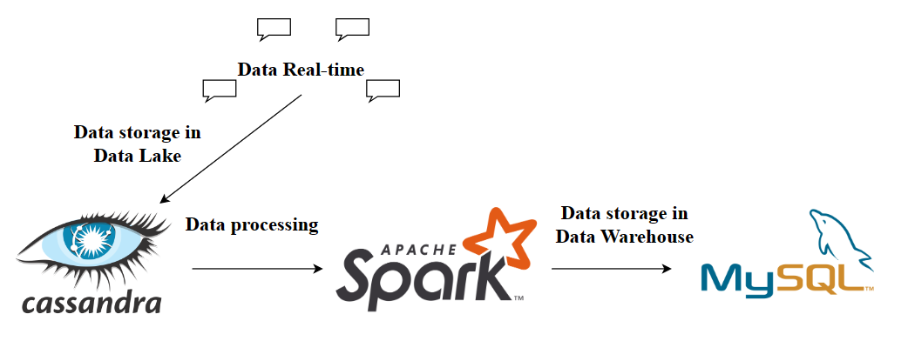
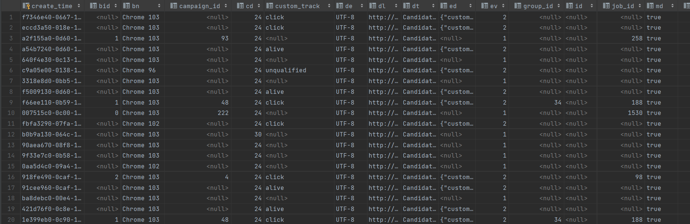
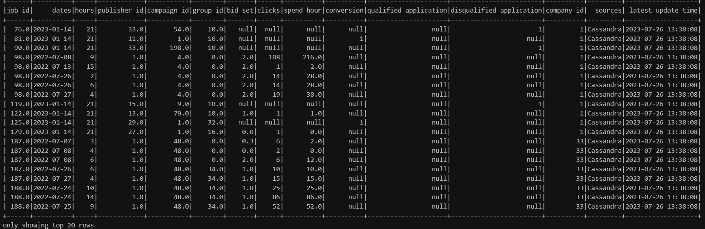

# Batch data processing system

### Objective
This project focuses on building a data processing and analysis system from log data from users of a recruitment website. The main goal is to store, process, analyze that log data and decide the next step of the business development. Raw data is stored in Cassandra (Data Lake), PySpark for transforming the data from Cassandra then put the processed data to MySQL, MySQL for data warehousing. Using Docker to deploy the project easily.
- Tech stack: PySpark, Docker, Cassandra, MySQL, Python.

### Architecture

### Raw data

### Process
1. Read raw data in Cassandra (Data Lake)
2. Use pyspark to process data
- Filter actions with analytical value in column ["custom_track"] including: clicks, conversion, qualified, unqualified.
- Remove null values, replace with 0 to be able to calculate.
- Join with "job" table in MySQL to get "company_id" column
3. Save data to MySQL

### Clean data

### Setup

##### Cassandra Setup
- [Install Cassandra](Setup/Setup_Cassandra.docx)

##### MySQL Setup
- [Install MySQL](Setup/Setup_MySQL.docx)

##### Spark Setup
- Install Spark 3.4